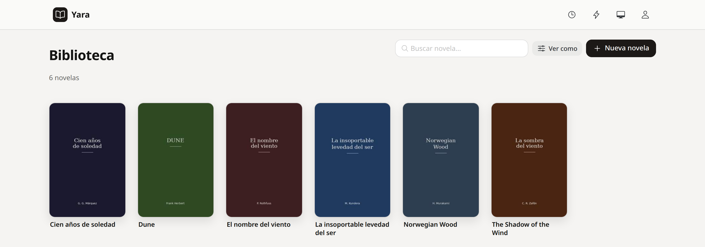
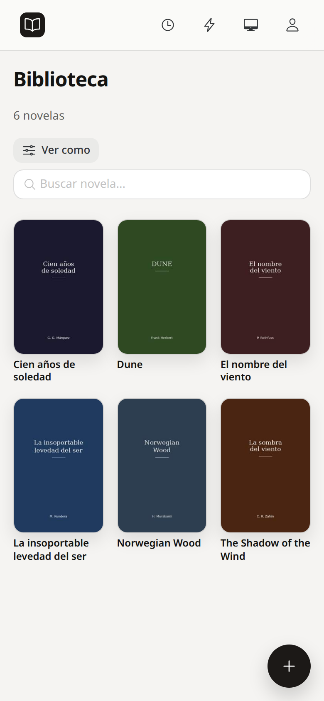
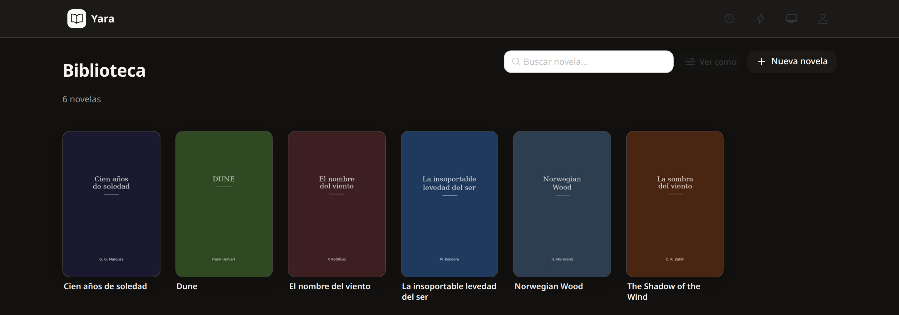
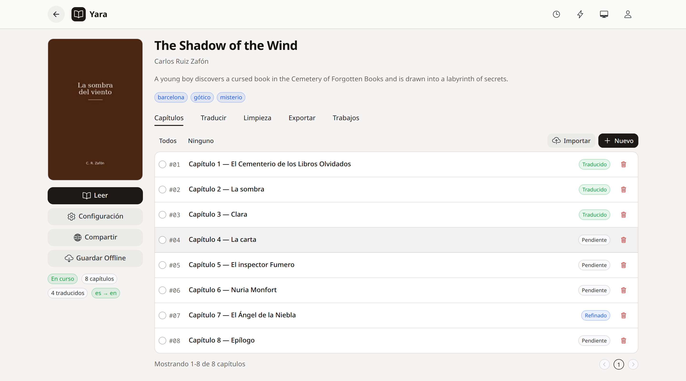
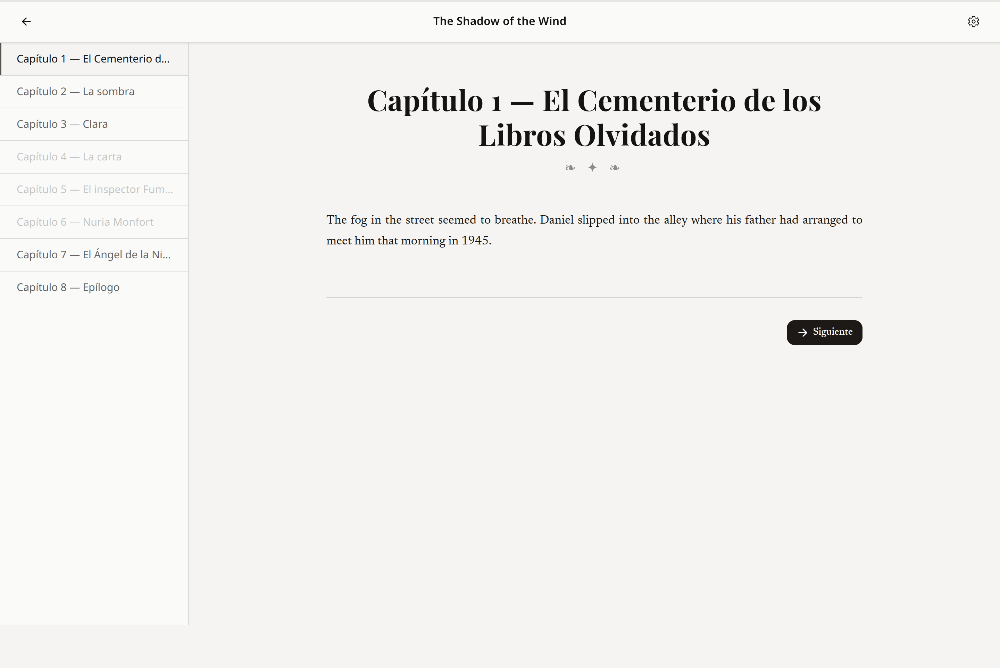
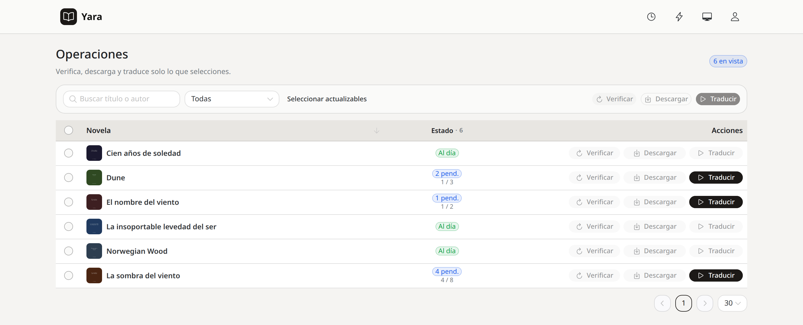
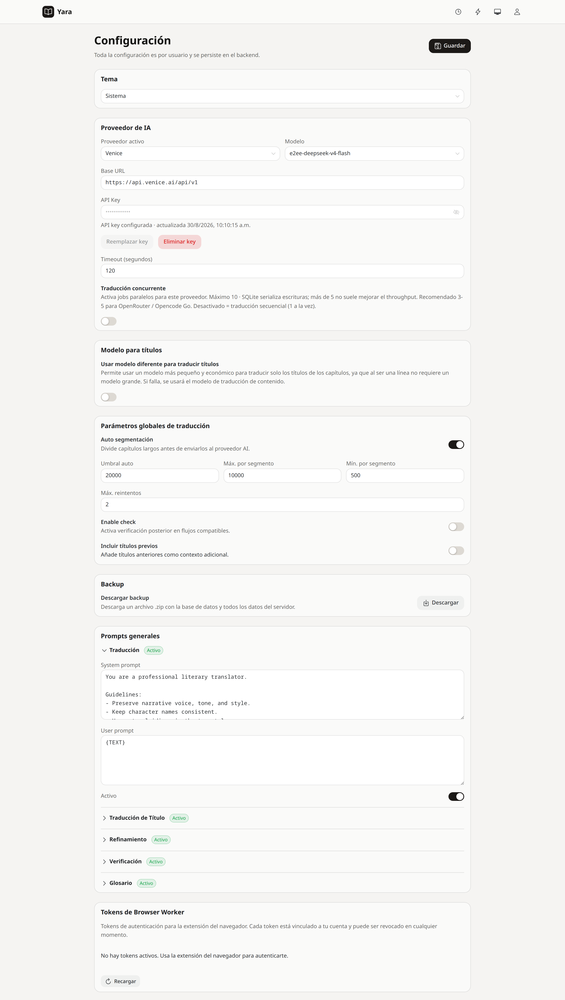
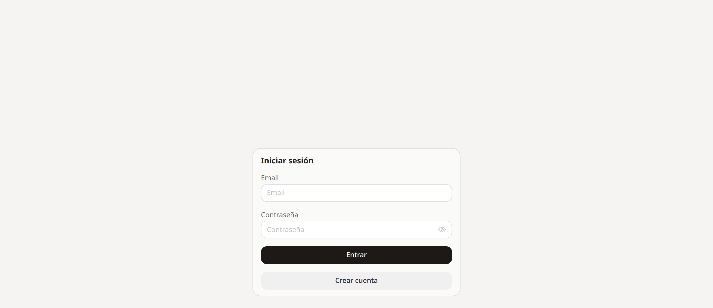

# Yara

**[English](README.md) · [Español](README.es.md)**

> **Your library + translation pipeline + reader.** A single Go binary with an embedded PocketBase and a Vue SPA that does it all: import novels, translate them with AI, refine the result, and read without friction.

---

## What Yara is

Yara is a **self-hosted server for readers who translate**. You import a novel (from a URL, an EPUB, or a ZIP), translate it chapter by chapter with the AI provider of your choice, refine the output, and read it in a reader built for long sessions. Everything runs in a single Go process — no external database, no microservices.

The product's DNA (see `PRODUCT.md`): [Readest](https://readest.com) / Calibre for library and reading polish, [Mihon](https://mihon.app)/Tachiyomi for the *manage + consume* duality on mobile. Chrome recedes; the text and the cover art lead.

### Origins

Yara is the evolution of [novel-translator](https://github.com/mfloresz/novel-translator), a desktop application written in Python and PyQt6. The original app proved the workflow — import, translate, read — but Yara rethinks it as a self-hosted server with a web UI, a versioned REST API, batch operations, reading-progress sync, and capabilities the desktop version never had.

### Android client

[yara-app](https://github.com/mfloresz/yara-app) is the companion Android client. It connects to a running Yara server and brings the library and the reader to your phone without going through a browser.

---

## Gallery

### Library

The main view. A 2:3 cover grid with real elevation only on the covers, instant search, and a "view as" menu. Each novel prefers its translated title when one exists.



<details><summary>Mobile version</summary>



A three-column grid at 390 px, search on top, floating "+" button. The top bar collapses to four icons without losing navigation.

</details>

Dark mode (same content, inverted warm-neutral ramp, semantic accents intact):



### Novel detail

A left sidebar (large cover + **Read** call to action + configuration actions) and tabs for **Chapters · Translate · Cleanup · Export · Jobs**.



Chapter states are visible at a glance: `pending` (gray), `translated` (green), `refined` (blue), `failed` (red). Multi-selection feeds the Translate and Cleanup tabs without reloading.

### Reader

A reading typeface (Geist, 1.05 rem / 1.75 line-height), a contained measure, chapter-to-chapter navigation, and a chapter sidebar where chapters without content appear dimmed.



The reader respects `prefers-reduced-motion` and persists reading position to the server, so a session can continue on another device.

### Operations (batch pipeline)

A control table for large libraries: **check → download → translate** only what you select, with text filters and per-row selection.



Batch actions are accepted asynchronously and queued server-side; progress is visible in the jobs drawer.

### Settings

All configuration is **per user** and persists in the backend: theme, active AI provider, segmentation parameters, prompts, and browser-worker tokens.



API keys are write-only — the server never returns them, only an `apiKeyConfigured` flag.

### Authentication



Sessions use an HttpOnly, `SameSite=Strict` cookie, with a bearer token also available for API clients.

---

## Supported sites

Yara imports novels directly from 11 sites:

- **Direct download** — NovelFire, FenrirRealm, CherryMist, SkyNovels, Literotica, WTR-Lab, NovelArrow.
- **Behind Cloudflare** — 69Shuba, EmpireNovel, FloraeGarden, SkyDemonOrder. These require the browser-worker extension (see below).

Novels can also be imported from EPUB or ZIP files, so any source outside the catalog still works.

### Browser-worker extension (Cloudflare-protected sites)

Cloudflare challenges can't be solved from the server, so Yara ships a browser extension — Chrome and Firefox, Manifest V3 — that relays requests through a real browser on your machine. You sign in from the extension with a browser-worker token (generated in Settings → Browser Worker tokens), and when a protected site shows a challenge the extension opens a background tab for you to solve it once; subsequent fetches to that origin reuse the cached cookies automatically. The extensions live in `extensions/browser-worker-chrome/` and `extensions/browser-worker-firefox/`, and each site in the catalog declares whether it needs this path via `RequiresBrowser()`.

For parser development there are also `-debug` variants of the extension that connect without auth to a standalone debug proxy (`cmd/debug-proxy`, port 5177).

---

## Typical flows

### 1 · Import and translate

```
Library → "New novel" → paste URL → preview → import
Novel detail → Translate tab → select chapters → choose provider/model → translate
Jobs (top-bar drawer) → watch progress in real time
```

The server downloads the first chapter synchronously and queues the rest. Long chapters are auto-segmented before being sent to the AI provider.

### 2 · Batch over large libraries

```
Operations → search/filter → select updatable → check
→ download (newly detected chapters) → translate (pending ones)
```

Checks and downloads share one queue; translations and refinements use another. A full queue answers `503` with `Retry-After: 30`.

### 3 · Export for publishing

```
Novel detail → Export tab → choose a variant (original / translated / refined) → download .epub
```

EPUBs are generated from the persisted chapters and served on demand.

---

## Design

The North Star (see `DESIGN.md`) is **"The Quiet Shelf"**: a single warm-stone ramp (bone paper `#fafaf9` → warm ink `#141413`), color reserved for semantic state, one typeface family (Geist/Inter), and real elevation only on book covers. Light/dark/system themes invert the same ramp instead of duplicating the palette.

Anti-references: no dense "admin dashboard" look, and no mobile-as-afterthought layouts.

---

## Stack

| Layer | Technology |
|---|---|
| Backend | Go 1.26, embedded PocketBase, `goai` for OpenAI-compatible providers, `log/slog` |
| Frontend | Vue 3 + Vite + Naive UI + TypeScript + vue-router + PWA |
| AI | 7 registered providers: `venice` (default), `openrouter`, `meta`, `opencode-go`, `opencode-zen`, `lmstudio`, `google` — keys stored with AES-GCM |
| Persistence | SQLite (via PocketBase), idempotent schema in `store_schema.go`, `--migrate-db` flag for breaking changes |
| Scraper | `internal/noveldownloader` — 11 parsers (NovelFire, FenrirRealm, FloraeGarden, CherryMist, EmpireNovel, 69Shuba, SkyNovels, SkyDemonOrder, Literotica, WTR-Lab, NovelArrow); `RequiresBrowser()` marks the ones behind Cloudflare |
| EPUB | `internal/epubimport` + `internal/epubexport` (pure packages, no HTTP/store dependencies) |
| Mobile | `android-arm64` build for Termux, plus the [yara-app](https://github.com/mfloresz/yara-app) client |

---

## Quickstart

### Development (two terminals)

```bash
# Terminal 1 — frontend with HMR on :5175 (proxies /api and /ai → :5176)
cd frontend && npm run dev

# Terminal 2 — backend on :5176
go run ./cmd/server --addr :5176 --data-dir ./data
```

After touching the frontend, `npm run build` (or `make build`) regenerates `frontend/dist/` — the Go binary embeds that directory, and a stale build silently serves the old SPA.

### Production

```bash
make build
./bin/translator-server-linux-amd64-<version> --addr :5176 --data-dir ./data
```

### Android / Termux

```bash
make android
# copy to the phone, then:
chmod +x translator-server-android-arm64-<version>
./translator-server-android-arm64-<version> --addr 127.0.0.1:5176 --data-dir ./data
```

### All platforms at once

```bash
make all        # linux-amd64, linux-arm64, linux-armv7, android-arm64, android-armv7
make compress   # UPX over the binaries (requires upx)
```

---

## Configuration

Resolution order: **CLI flag > env var > default** (see `internal/config/config.go`).

**Flags** — `--addr` (default `:5176`), `--port`, `--data-dir` (next to the binary), `--static-dir` (dev: serve `frontend/dist` from disk), `--migrate-db`, `--migrate-thumbnails`, `--version`.

**Environment** — `APP_ENCRYPTION_KEY` (base64/hex, 32 bytes decoded; auto-generated at `<data-dir>/app.key` if unset), `STATIC_DIR`, `DOWNLOAD_MIN_DELAY_MS` / `DOWNLOAD_MAX_DELAY_MS` (import-from-URL throttling), `ADDR` / `PORT` / `DATA_DIR` (flag fallbacks), `VITE_API_URL` (SPA base-URL override).

---

## API

A single surface: **`/api/v1/*`** — envelope `{data, meta, links}`, `X-API-Version: v1` header, and `application/problem+json` errors. Full reference in [`docs/api/README.md`](docs/api/README.md) and the machine-readable spec in [`docs/api/openapi.yaml`](docs/api/openapi.yaml).

Canonical pagination `?page=1&per_page=50` (with a `?limit&offset` compat form), sparse fieldsets via `?fields=id,sourceTitle,status`, `202 Accepted` for async jobs, `204` for deletes.

---

## Project layout

```
cmd/server/            Entrypoint (config → encryptor → PocketBase → store → api → ListenAndServe)
cmd/debug-proxy/       Micro-server on :5177 for debugging parsers behind Cloudflare
internal/api/          HTTP layer — one router_*.go per resource, job worker in runtime_*.go
internal/store/        PocketBase persistence — collections seeded by EnsureSchema()
internal/ai/           Provider interface + OpenAIProvider + registry.go
internal/secure/       AES-GCM for API keys
internal/noveldownloader/  Pure parsers
internal/epubimport/ / epubexport/
frontend/              Vue 3 SPA — pages/, components/, composables/, app/services.ts
frontend_embed.go      //go:embed all:frontend/dist
extensions/            browser-worker-chrome / firefox (+ -debug variants without auth)
docs/                  API docs and architecture codemaps
```

---

## Testing

```bash
go test ./...            # unit + integration (real PocketBase in t.TempDir, no mocks)
go test -short ./...     # skips live-URL tests in noveldownloader/realtest_test.go
npm run build            # the real typecheck (vue-tsc -b && vite build)
go vet ./...
```

The integration tests in `internal/api/` lock the v1 envelope shape, status codes, and `Location` headers.

---

## Operations notes

- PocketBase runs **in-process** — there is no admin port or `/_/` UI. The server exposes `/healthz`, `/ws/browser-worker`, `/api/v1/*`, the auth entry points, and the SPA fallback.
- The job worker is in-process: two buffered queues (capacity 128) with one goroutine each. Per-provider concurrency (1–10, default 1) is wired through `errgroup.SetLimit`.
- `EnsureSchema()` does not backfill stats at boot; novel stats are recalculated after each chapter/job/import mutation.
- Debugging sites behind Cloudflare: run `go run ./cmd/debug-proxy` on `:5177`, connect a `browser-worker-*-debug` extension, and relay fetches through `POST :5177/api/proxy/fetch`.

---

## License

Copyright © 2026 Misael Flores.

Yara is free software: you can redistribute it and/or modify it under the terms of the **GNU Affero General Public License** as published by the Free Software Foundation, either version 3 of the License, or (at your option) any later version. See the [`LICENSE`](LICENSE) file for the full text.

Because Yara is licensed under AGPL-3.0, any modified version that you make available to other users over a network (including as a hosted service) must also be made available under AGPL-3.0 with its source code accessible to those users.
